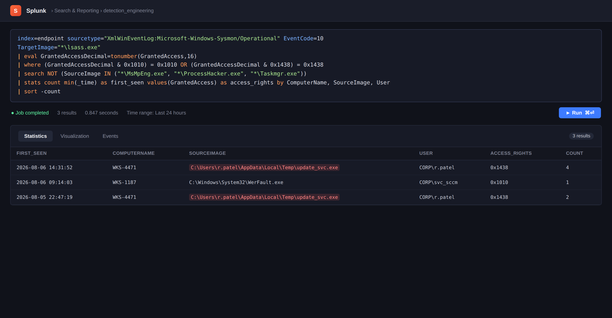
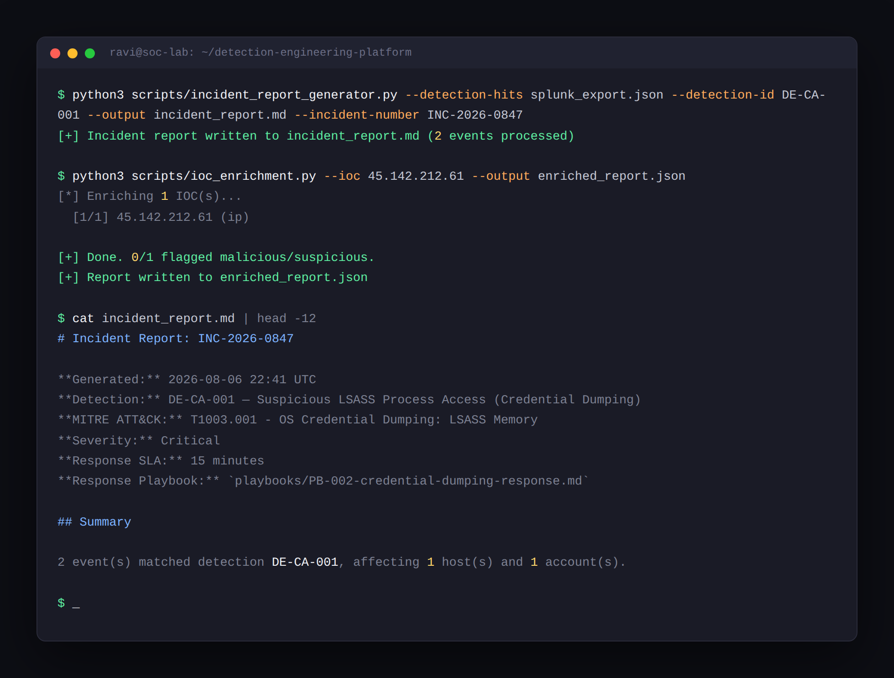
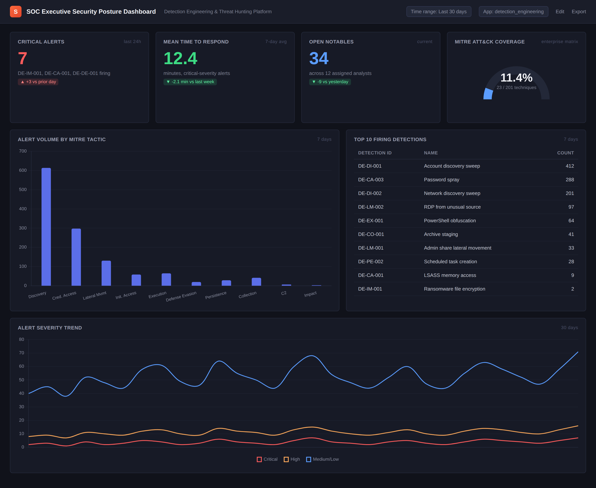
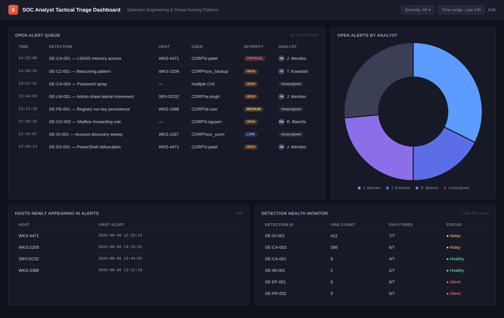

# Enterprise Detection Engineering & Threat Hunting Platform

A portfolio project demonstrating an end-to-end detection engineering program built on Splunk: threat-informed
detection content mapped to MITRE ATT&CK, executive and analyst-facing dashboards, Python automation for IOC
enrichment and incident reporting, and severity-tiered incident response playbooks.

Built to demonstrate the full lifecycle a detection engineer or SOC analyst owns in practice — not just
writing a search, but documenting it, tuning it, visualizing it, and operationalizing the response around it.

## Why This Project

Most portfolio SIEM projects stop at "here's a detection rule." This one covers the full loop a real
detection engineering function owns:

**Threat intel → Detection logic → Alert triage → Response → Feedback loop**

## What's Inside

| Directory | Contents |
|---|---|
| [`/detections`](./detections) | 23 SPL detection rules across 12 MITRE ATT&CK tactics, each fully documented with logic, false-positive analysis, and tuning notes |
| [`/architecture`](./architecture) | Data flow diagram and platform design decisions |
| [`/dashboards`](./dashboards) | 2 Splunk Dashboard Studio exports — executive security posture view and SOC analyst triage workspace |
| [`/scripts`](./scripts) | Python automation: IOC enrichment (`ioc_enrichment.py`) and incident report generation (`incident_report_generator.py`) |
| [`/playbooks`](./playbooks) | 5 severity-tiered incident response playbooks (ransomware, credential dumping, log tampering, account compromise, C2 beaconing) |
| [`/docs`](./docs) | MITRE ATT&CK coverage map, ATT&CK Navigator layer, detection documentation standards, required lookup reference |

## MITRE ATT&CK Coverage

23 detections spanning Initial Access through Impact. Full mapping in
[`docs/mitre_attack_mapping.md`](./docs/mitre_attack_mapping.md); import
[`docs/attack_navigator_layer.json`](./docs/attack_navigator_layer.json) into the
[ATT&CK Navigator](https://mitre-attack.github.io/attack-navigator/) for the visual heatmap.

| Severity | Count |
|---|---|
| Critical | 6 |
| High | 9 |
| Medium | 6 |
| Low | 2 |


## Architecture


The architecture shows the end-to-end flow from endpoint, identity, and network telemetry through Splunk ingestion and detection engineering, into alert triage, automation, dashboards, and incident response.


## Example Detection

`detections/credential_access/T1003_001_lsass_memory_access.spl` — flags processes requesting
high-privilege memory access to `lsass.exe`, the signature of Mimikatz-style credential dumping
(MITRE T1003.001):

```spl
index=endpoint sourcetype="XmlWinEventLog:Microsoft-Windows-Sysmon/Operational" EventCode=10
TargetImage="*\lsass.exe"
| eval GrantedAccessDecimal=tonumber(GrantedAccess,16)
| where (GrantedAccessDecimal & 0x1010) = 0x1010 OR (GrantedAccessDecimal & 0x1438) = 0x1438
| search NOT (SourceImage IN ("*\MsMpEng.exe", "*\ProcessHacker.exe", ...))
| stats count min(_time) as first_seen ... by ComputerName, SourceImage, User
```

Every detection includes the reasoning behind the logic, known false-positive sources, and tuning guidance —
not just the query.

## Detection Running in Splunk



*Note: built without a live licensed Splunk instance — this is a UI mockup matching Splunk's Search &
Reporting layout, running the real query from `detections/credential_access/T1003_001_lsass_memory_access.spl`
against sample data. See [`architecture/screenshots/README.md`](./architecture/screenshots/README.md) for
full provenance notes on every image in this repo.*

## Python Automation in Action



*This screenshot is not a mockup — it's the actual output of the commands below.*

```bash
# Enrich IOCs pulled from a detection hit against AbuseIPDB / VirusTotal / OTX
python3 scripts/ioc_enrichment.py --input suspicious_iocs.csv --output enriched.json

# Turn a raw Splunk export into an analyst-ready incident report
python3 scripts/incident_report_generator.py \
    --detection-hits splunk_export.json \
    --detection-id DE-CA-001 \
    --enrichment enriched.json \
    --output incident_report.md
```

Both scripts are self-contained, use only the Python standard library plus `urllib` for API calls (no
heavyweight dependencies), and fail gracefully — a single dead API or malformed IOC never crashes a batch run.

## Incident Response Playbooks

| Playbook | Severity | SLA | Triggering Detection |
|---|---|---|---|
| [Ransomware Containment](./playbooks/PB-001-ransomware-containment.md) | Critical | 15 min | DE-IM-001 |
| [Credential Dumping Response](./playbooks/PB-002-credential-dumping-response.md) | Critical | 15 min | DE-CA-001 |
| [Log Tampering Response](./playbooks/PB-003-log-tampering-response.md) | Critical | 15 min | DE-DE-001 |
| [Account Compromise Response](./playbooks/PB-004-account-compromise-response.md) | High | 60 min | DE-CA-003 |
| [C2 Beaconing Response](./playbooks/PB-005-c2-beaconing-response.md) | High | 60 min | DE-C2-001 |

## Dashboards

**Executive Security Posture** — critical alert volume, MTTR, MITRE coverage gauge, 30-day severity trend.
For weekly leadership review.



**SOC Analyst Triage** — live open-alert queue, workload distribution, newly-appearing hosts, and a
detection health monitor to catch noisy or silently-failing detections before they erode analyst trust.



Import the `.json` files in `/dashboards` via **Splunk → Dashboards → Create New Dashboard → Dashboard Studio
→ Import JSON**. Both reference the lookup in `docs/detection_mitre_lookup.csv` — see
[`docs/required_lookups.md`](./docs/required_lookups.md) for setup.

## Setup

1. Deploy Splunk Enterprise (or use a free Splunk Cloud trial / local Docker instance).
2. Ingest Sysmon, Windows Security, PowerShell Operational, and firewall/proxy logs via Universal Forwarders.
3. Upload the lookup tables listed in [`docs/required_lookups.md`](./docs/required_lookups.md).
4. Create saved searches from each `.spl` file in `/detections`, scheduled per its severity tier (see
   [`docs/detection_documentation.md`](./docs/detection_documentation.md) for the deployment checklist —
   **run every detection in notify-only mode for 2 weeks before enabling paging.**
5. Import the dashboards from `/dashboards`.
6. Configure API keys as environment variables (`ABUSEIPDB_API_KEY`, `VT_API_KEY`, `OTX_API_KEY`) to use
   `scripts/ioc_enrichment.py`.

## Roadmap

See "Coverage Gaps" in [`docs/mitre_attack_mapping.md`](./docs/mitre_attack_mapping.md) for what's
deliberately out of scope in this phase (cloud control-plane detections, container/K8s techniques, UEBA
baselining) and planned for future iterations.

## Author

Built as a hands-on portfolio project to demonstrate practical SOC analyst / detection engineering
capability: SPL query writing, MITRE ATT&CK-driven detection design, dashboard development, security
automation in Python, and incident response process design.
