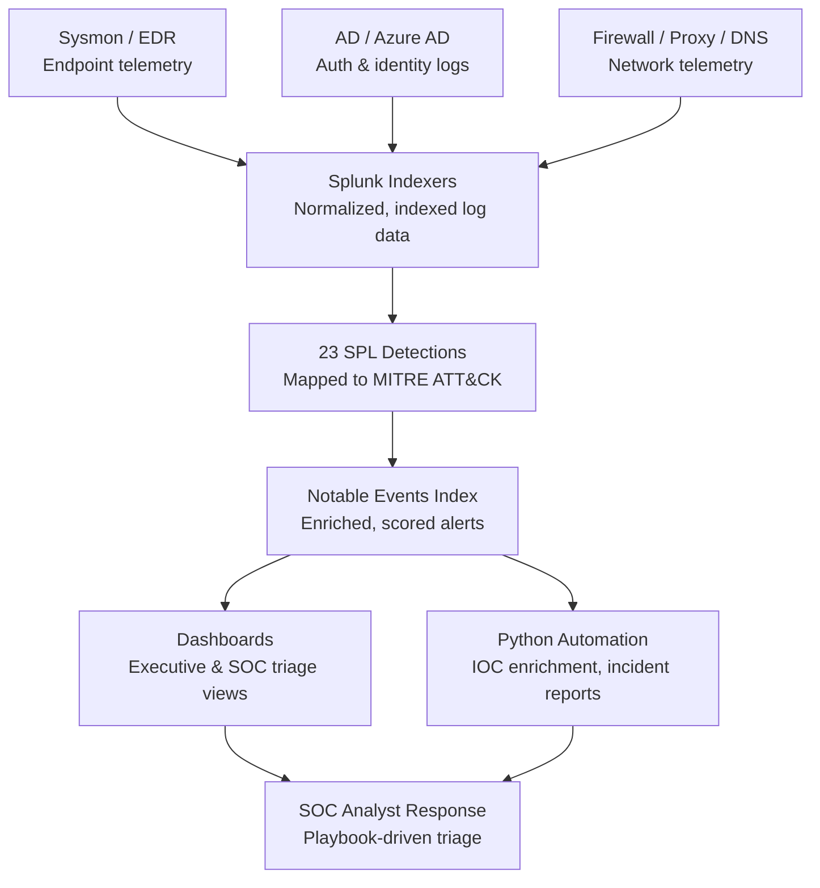

# Platform Architecture

## Data Flow

## Component Breakdown

| Layer | Component | Purpose |
|---|---|---|
| Collection | Sysmon (endpoint), Windows Event Forwarding, O365 Management Activity API, firewall/proxy syslog | Raw telemetry generation at the source |
| Ingestion | Splunk Universal Forwarders → Heavy Forwarders → Indexers | Normalization, field extraction, indexing |
| Detection | `/detections/` — 23 SPL correlation searches | Pattern-matches telemetry against known TTPs, tagged by MITRE ATT&CK technique |
| Alerting | Notable Events index (`index=notable`) | Central store for all detection hits, feeding both dashboards and automation |
| Presentation | `/dashboards/` — Executive Posture + SOC Triage (Splunk Dashboard Studio) | Two audiences, two views: leadership trend reporting vs. analyst working queue |
| Automation | `/scripts/` — `ioc_enrichment.py`, `incident_report_generator.py` | Removes manual triage toil: enrichment lookups and report formatting |
| Response | `/playbooks/` — 5 severity-tiered IR playbooks | Standardizes analyst response regardless of who's on shift |

## Design Decisions

- **Detection-as-code layout** (one `.spl` file per detection, organized by MITRE tactic folder) mirrors how
  mature detection engineering teams version-control content in git rather than only inside the Splunk UI —
  this repo doubles as the source of truth that would sync to Splunk via a CI/CD pipeline (e.g.
  `splunk-add-on-for-content-packs` or a custom deployment script) in a production setup.
- **Severity-tiered playbooks** rather than one generic IR doc, because a password-spray alert and a
  ransomware alert have wildly different response SLAs (60 min vs. 15 min) and escalation paths — collapsing
  them into one playbook either over-escalates the common case or under-escalates the critical one.
- **Python automation is intentionally source-agnostic at the enrichment layer** (works from any JSON export,
  not tied to a live Splunk connection) so the same scripts work whether pulling from the Splunk REST API, a
  SOAR platform export, or a manual analyst CSV — lowers the bar for adoption in different lab/SOC setups.

## What This Doesn't Cover (Scope Boundary)

This is a detection engineering and threat hunting platform — it does not include SIEM infrastructure
deployment (indexer clustering, forwarder management) or a SOAR orchestration layer. Those are deliberately
out of scope; see `docs/mitre_attack_mapping.md` for the coverage roadmap.
