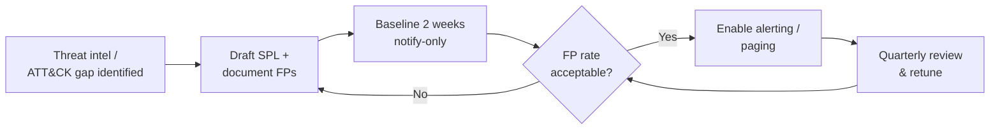

# Detection Documentation

## How to Read a Detection File

Every file in `/detections/<tactic>/` follows the same structure:

1. **Header block** — Detection ID, MITRE ATT&CK mapping, required data source, and severity rating.
2. **SPL query** — the actual Splunk search, ready to paste into a saved search / correlation search.
3. **Detection Logic** — plain-English explanation of *why* this pattern indicates malicious activity.
4. **False Positive Considerations** — known legitimate activity that can trigger the same pattern, and how
   to exclude it.
5. **Tuning Notes** — environment-specific adjustments a SOC would make before going live (thresholds,
   allowlists, required log source configuration).

## Naming Convention

`<technique-id>_<short-description>.spl` — e.g. `T1003_001_lsass_memory_access.spl`. Detection IDs
(`DE-<tactic-abbreviation>-<number>`) are the stable identifier referenced in dashboards, playbooks, and
incident reports — the filename can change; the ID should not.

## Severity Definitions

| Severity | Definition | Response SLA |
|---|---|---|
| Critical | High-confidence indicator of active compromise or imminent impact (ransomware, credential theft, log tampering) | 15 minutes |
| High | Strong indicator requiring prompt investigation; moderate false-positive rate | 60 minutes |
| Medium | Suspicious but frequently benign; useful primarily in correlation with other signals | 4 hours |
| Low | Reconnaissance/enrichment signal; not independently actionable | 24 hours |

## Deployment Checklist (Before Enabling in Production)

- [ ] Confirm the required data source (see each detection's header) is actively ingested and correctly
      parsed — validate field extractions with a raw `| head 10` before relying on `stats`/`where` logic.
- [ ] Build and populate the lookup tables referenced in detections that use them (see
      `/docs/required_lookups.md`).
- [ ] Run each detection in "notify only, no auto-response" mode for a minimum 2-week baseline period to
      characterize false-positive rate in your specific environment.
- [ ] Assign each detection an owner responsible for tuning and lifecycle (deprecation when a technique is
      retired or superseded).
- [ ] Wire Critical-severity detections to the paging system; route Medium/Low to the triage queue only.

## Detection Engineering Lifecycle

